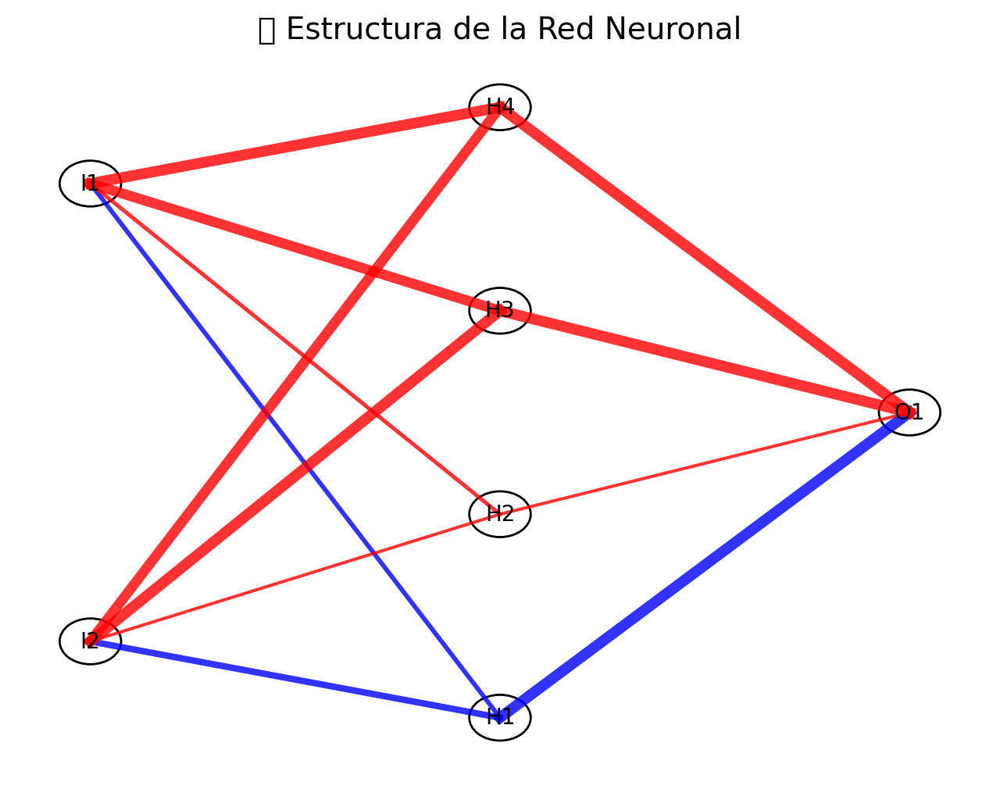
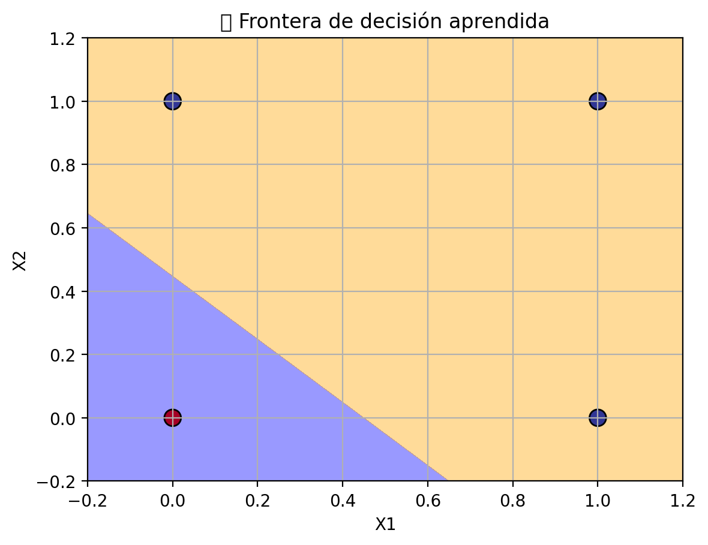

# 🤖 Inteligencia Artificial

Bienvenido al repositorio **Inteligencia Artificial**, un proyecto educativo y visual para aprender los fundamentos de las redes neuronales desde cero.  
Este módulo está especialmente diseñado para estudiantes principiantes y entusiastas que deseen comprender cómo una red neuronal aprende mediante entrenamiento supervisado.

## 🎯 Objetivo

Este proyecto implementa y visualiza una red neuronal simple que aprende la función lógica **OR**.  
Todo el proceso —desde la arquitectura, entrenamiento, hasta la visualización de pesos y la frontera de decisión— es totalmente interactivo gracias a [Streamlit](https://streamlit.io/).

## 🚀 ¿Qué incluye?

- **Arquitectura visual** de una red neuronal con:
  - 2 neuronas de entrada
  - 1 capa oculta con 4 neuronas
  - 1 neurona de salida
- Entrenamiento con algoritmo **Backpropagation**
- Visualización de:
  - Estructura de la red 🧠
  - Pesos y conexiones 🔗
  - Frontera de decisión 📈
  - Predicciones generadas por la red 🎯

## 🧪 Tecnologías utilizadas

- [Python 3](https://www.python.org/)
- [NumPy](https://numpy.org/)
- [Matplotlib](https://matplotlib.org/)
- [Streamlit](https://streamlit.io/)

## 📸 Capturas de pantalla

### 🧠 Arquitectura de la red


### 📈 Frontera de decisión


## 🛠 Cómo ejecutar

1. Clona este repositorio:

   ```bash
   git clone https://github.com/tu_usuario/Inteligencia-Artificial.git
   cd Inteligencia-Artificial
   ```

2. Instala las dependencias:

   ```bash
   pip install -r requirements.txt
   ```

3. Ejecuta la aplicación:

   ```bash
   streamlit run app.py
   ```

## 📁 Estructura del repositorio

```
📦 Inteligencia-Artificial
├── app.py                  # Archivo principal con la red neuronal visual
├── requirements.txt        # Dependencias del proyecto
├── img/                    # Imágenes opcionales para README
└── README.md
```

## 📚 Conceptos que se aprenden

- Función de activación sigmoide
- Inicialización de pesos
- Propagación hacia adelante
- Retropropagación del error
- Visualización de arquitectura y resultados

## 🧠 Créditos

Este proyecto ha sido diseñado con un enfoque pedagógico para la enseñanza de redes neuronales.  
Si estás aprendiendo IA, este es tu punto de partida visual e interactivo.

## 📬 Contacto

¿Tienes ideas, sugerencias o deseas colaborar?  
Puedes abrir un issue o contactar directamente.
